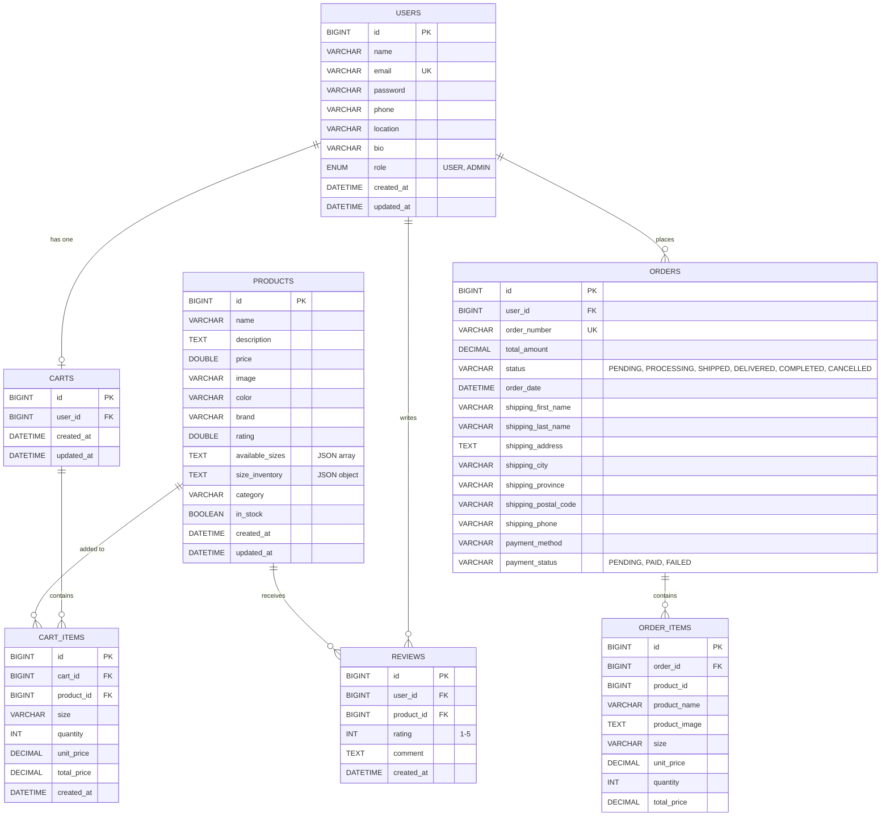

# ShoeStop E-Commerce - Entity Relationship Diagram

## Database Schema Overview

This document describes the database schema for the ShoeStop e-commerce application.

---

## ERD Diagram (Mermaid)



---

## Table Descriptions

### 1. USERS
Stores user account information including authentication and profile data.

| Column | Type | Constraints | Description |
|--------|------|-------------|-------------|
| id | BIGINT | PK, AUTO_INCREMENT | Unique identifier |
| name | VARCHAR(50) | NOT NULL | User's display name |
| email | VARCHAR(255) | NOT NULL, UNIQUE | Login email |
| password | VARCHAR(255) | NOT NULL | Hashed password |
| phone | VARCHAR(20) | | Contact number |
| location | VARCHAR(255) | | User's location |
| bio | VARCHAR(500) | | User biography |
| role | ENUM | NOT NULL, DEFAULT 'USER' | USER or ADMIN |
| created_at | DATETIME | | Account creation timestamp |
| updated_at | DATETIME | | Last update timestamp |

---

### 2. PRODUCTS
Stores product catalog information including inventory data as embedded JSON.

| Column | Type | Constraints | Description |
|--------|------|-------------|-------------|
| id | BIGINT | PK, AUTO_INCREMENT | Unique identifier |
| name | VARCHAR(100) | NOT NULL | Product name |
| description | TEXT(1000) | NOT NULL | Product description |
| price | DOUBLE | NOT NULL, POSITIVE | Price in PHP |
| image | VARCHAR(255) | | Main image filename |
| color | VARCHAR(50) | | Product color |
| brand | VARCHAR(50) | | Brand name |
| rating | DOUBLE | DEFAULT 4.5 | Average rating (1-5) |
| available_sizes | TEXT | | JSON array of sizes, e.g., `["7", "7.5", "8"]` |
| size_inventory | TEXT | | JSON object with inventory per size |
| category | VARCHAR(50) | NOT NULL | Category (casual, running, sports, limited) |
| in_stock | BOOLEAN | NOT NULL, DEFAULT TRUE | Stock availability flag |
| created_at | DATETIME | | Creation timestamp |
| updated_at | DATETIME | | Last update timestamp |

**Size Inventory JSON Format:**
```json
{
  "7": {"quantity": 50, "reserved": 0},
  "7.5": {"quantity": 50, "reserved": 2},
  "8": {"quantity": 45, "reserved": 5}
}
```

---

### 3. CARTS
Shopping cart associated with each user (one-to-one relationship).

| Column | Type | Constraints | Description |
|--------|------|-------------|-------------|
| id | BIGINT | PK, AUTO_INCREMENT | Unique identifier |
| user_id | BIGINT | FK → USERS(id) | Cart owner |
| created_at | DATETIME | | Cart creation timestamp |
| updated_at | DATETIME | | Last modification timestamp |

---

### 4. CART_ITEMS
Individual items in a shopping cart.

| Column | Type | Constraints | Description |
|--------|------|-------------|-------------|
| id | BIGINT | PK, AUTO_INCREMENT | Unique identifier |
| cart_id | BIGINT | FK → CARTS(id) | Parent cart |
| product_id | BIGINT | FK → PRODUCTS(id) | Product reference |
| size | VARCHAR(10) | | Selected shoe size |
| quantity | INT | | Number of items |
| unit_price | DECIMAL(10,2) | | Price per unit |
| total_price | DECIMAL(10,2) | | quantity × unit_price |
| created_at | DATETIME | | Item added timestamp |

---

### 5. ORDERS
Customer orders with shipping and payment information.

| Column | Type | Constraints | Description |
|--------|------|-------------|-------------|
| id | BIGINT | PK, AUTO_INCREMENT | Unique identifier |
| user_id | BIGINT | FK → USERS(id), NOT NULL | Customer |
| order_number | VARCHAR(50) | UNIQUE, NOT NULL | Display order number (ORD-xxx) |
| total_amount | DECIMAL(10,2) | NOT NULL | Order total in PHP |
| status | VARCHAR(20) | NOT NULL, DEFAULT 'PENDING' | Order status |
| order_date | DATETIME | NOT NULL | Order placement time |
| shipping_first_name | VARCHAR(50) | | Recipient first name |
| shipping_last_name | VARCHAR(50) | | Recipient last name |
| shipping_address | TEXT | | Delivery address |
| shipping_city | VARCHAR(50) | | City |
| shipping_province | VARCHAR(50) | | Province |
| shipping_postal_code | VARCHAR(10) | | Postal code |
| shipping_phone | VARCHAR(20) | | Contact number |
| payment_method | VARCHAR(20) | | COD, GCash, etc. |
| payment_status | VARCHAR(20) | DEFAULT 'PENDING' | Payment status |

**Order Status Values:** `PENDING`, `PROCESSING`, `SHIPPED`, `DELIVERED`, `COMPLETED`, `CANCELLED`

**Payment Status Values:** `PENDING`, `PAID`, `FAILED`

---

### 6. ORDER_ITEMS
Line items within an order (snapshot of product at time of purchase).

| Column | Type | Constraints | Description |
|--------|------|-------------|-------------|
| id | BIGINT | PK, AUTO_INCREMENT | Unique identifier |
| order_id | BIGINT | FK → ORDERS(id), NOT NULL | Parent order |
| product_id | BIGINT | NOT NULL | Original product ID (reference only) |
| product_name | VARCHAR(100) | NOT NULL | Product name snapshot |
| product_image | TEXT | | Image path snapshot |
| size | VARCHAR(10) | | Selected size |
| unit_price | DECIMAL(10,2) | NOT NULL | Price at time of order |
| quantity | INT | NOT NULL | Quantity ordered |
| total_price | DECIMAL(10,2) | NOT NULL | Line item total |

---

### 7. REVIEWS
Product reviews submitted by users.

| Column | Type | Constraints | Description |
|--------|------|-------------|-------------|
| id | BIGINT | PK, AUTO_INCREMENT | Unique identifier |
| user_id | BIGINT | FK → USERS(id), NOT NULL | Review author |
| product_id | BIGINT | FK → PRODUCTS(id), NOT NULL | Reviewed product |
| rating | INT | NOT NULL | Star rating (1-5) |
| comment | TEXT | | Review text |
| created_at | DATETIME | NOT NULL | Review submission time |

---

## Relationships Summary

| Relationship | Type | Description |
|--------------|------|-------------|
| USERS → CARTS | 1:1 | Each user has one cart |
| USERS → ORDERS | 1:N | User can place many orders |
| USERS → REVIEWS | 1:N | User can write many reviews |
| CARTS → CART_ITEMS | 1:N | Cart contains multiple items |
| PRODUCTS → CART_ITEMS | 1:N | Product can be in multiple carts |
| PRODUCTS → REVIEWS | 1:N | Product can have multiple reviews |
| ORDERS → ORDER_ITEMS | 1:N | Order contains multiple line items |

---

## Visual ERD (ASCII)

```
┌─────────────┐       ┌─────────────┐       ┌─────────────┐
│   USERS     │       │   CARTS     │       │ CART_ITEMS  │
├─────────────┤       ├─────────────┤       ├─────────────┤
│ id (PK)     │──1:1──│ id (PK)     │──1:N──│ id (PK)     │
│ name        │       │ user_id(FK) │       │ cart_id(FK) │
│ email (UK)  │       │ created_at  │       │ product_id  │──┐
│ password    │       │ updated_at  │       │ size        │  │
│ phone       │       └─────────────┘       │ quantity    │  │
│ location    │                             │ unit_price  │  │
│ bio         │                             │ total_price │  │
│ role        │                             └─────────────┘  │
│ created_at  │                                              │
│ updated_at  │                                              │
└─────────────┘                                              │
      │                                                      │
      │ 1:N                                                  │
      ▼                                                      │
┌─────────────┐       ┌─────────────┐                        │
│   ORDERS    │       │ ORDER_ITEMS │                        │
├─────────────┤       ├─────────────┤                        │
│ id (PK)     │──1:N──│ id (PK)     │                        │
│ user_id(FK) │       │ order_id(FK)│                        │
│ order_number│       │ product_id  │                        │
│ total_amount│       │ product_name│                        │
│ status      │       │ size        │                        │
│ order_date  │       │ quantity    │                        │
│ shipping_*  │       │ unit_price  │                        │
│ payment_*   │       │ total_price │                        │
└─────────────┘       └─────────────┘                        │
      │                                                      │
      │ 1:N                                                  │
      ▼                                                      │
┌─────────────┐       ┌─────────────┐                        │
│  REVIEWS    │       │  PRODUCTS   │◄───────────────────────┘
├─────────────┤       ├─────────────┤
│ id (PK)     │──N:1──│ id (PK)     │
│ user_id(FK) │       │ name        │
│ product_id  │──N:1──│ description │
│ rating      │       │ price       │
│ comment     │       │ image       │
│ created_at  │       │ color       │
└─────────────┘       │ brand       │
                      │ rating      │
                      │ sizes (JSON)│
                      │ inventory   │
                      │ category    │
                      │ in_stock    │
                      └─────────────┘
```

---

## Notes

1. **Size Inventory Embedded in Products**: The `size_inventory` column stores inventory data as JSON, eliminating the need for a separate inventory table.

2. **Order Items are Snapshots**: `ORDER_ITEMS` stores product information at the time of purchase, so changes to products don't affect historical orders.

3. **Soft References**: `ORDER_ITEMS.product_id` is stored as a value (not FK) for historical reference since products could be deleted.

4. **User Roles**: The system supports `USER` and `ADMIN` roles for access control.

